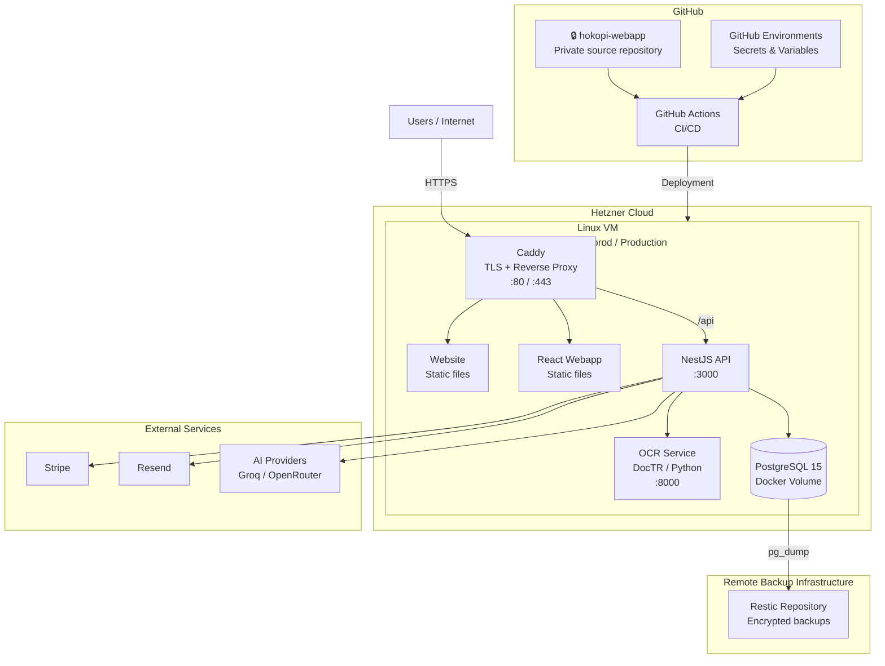
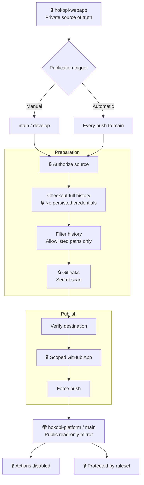

# HoKoPi Platform

This is a **generated, read-only public mirror** of HoKoPi's Platform Engineering work.
The private Webapp monorepo is the source of truth; each publication rebuilds this
repository from filtered Git history and allowlisted Platform paths only.

| Area                                   | Public contents                                                                               |
| -------------------------------------- | --------------------------------------------------------------------------------------------- |
| Containerization and local development | [Dockerfiles and Compose](./docker), [Makefile](./Makefile), [.dockerignore](./.dockerignore) |
| CI/CD definitions                      | [GitHub Actions workflows](./.github/workflows)                                               |
| Operational tooling                    | [Operations scripts and configuration](./ops)                                                 |

Changes must originate from the private source repository. Direct changes or pull
requests to this mirror will be overwritten by a subsequent publication.

## Architecture

HoKoPi currently runs on a **Hetzner Cloud + Docker Compose** architecture, with separate **pre-production** and **production** environments.

### Runtime

The application is deployed using **Docker Compose** on Linux VMs hosted at Hetzner.

| Component         | Role                                                                                 |
| ----------------- | ------------------------------------------------------------------------------------ |
| **Caddy**         | HTTPS termination, automatic TLS certificates, static file serving and reverse proxy |
| **Frontend**      | React/Vite HoKoPi web application                                                    |
| **Website**       | Public HoKoPi marketing website                                                      |
| **Backend**       | NestJS REST API                                                                      |
| **OCR**           | Python/DocTR OCR microservice                                                        |
| **PostgreSQL 15** | Primary relational database                                                          |

## About this repository

### Platform mirror workflow and security controls

### Security boundary

| Control                         | Protection                                                                                                                                      |
| ------------------------------- | ----------------------------------------------------------------------------------------------------------------------------------------------- |
| 🔒 **Checkout credentials**     | The private Webapp checkout credential is never persisted or reused for publication.                                                            |
| **History filtering**           | `git-filter-repo` rebuilds the repository using only approved Platform paths.                                                                   |
| 🔒 **Secret scanning**          | `Gitleaks` scans the complete filtered Git history before the publication destination is authenticated.                                         |
| 🔒 **Dedicated GitHub App**     | Publications use a credential scoped specifically to `hokopi-platform`.                                                                         |
| 🔒 **Repository ruleset**       | Direct human updates, deletions, and force-pushes to `main` are blocked. The HoKoPi Platform Publisher App is the authorized publication actor. |
| 🔒 **GitHub Actions disabled**  | Mirrored workflow definitions are visible, but cannot execute in the public repository.                                                         |
| 🔒 **Private product boundary** | Application source code, runtime secrets, deployment credentials, private packages, releases, and container images remain private.              |

The public mirror is a **generated, read-only representation of Platform Engineering work**, not an independent deployment repository.
